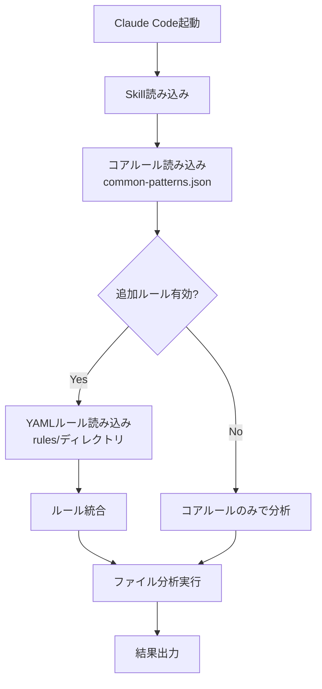

# YAML Rules Integration - 実現可能性分析

## 📋 概要

既存のYAMLルールファイル（BugSearch3など）をSmart Review Systemに統合する場合の実現可能性、プロコン、実装案を分析します。

## 🎯 想定されるYAMLルール構造

```yaml
# 例: null-check-rule.yaml
id: NC001
name: "Null pointer check missing"
category: "debug"
severity: "high"
language: "javascript"
pattern: |
  \w+\.\w+\.\w+
description: "Multiple property access without null check"
recommendation: "Use optional chaining (?.) or null checks"
examples:
  bad: "user.profile.name"
  good: "user?.profile?.name"
tags: ["null-safety", "defensive-programming"]
cwe: "CWE-476"
```

## 📊 統合方式の比較

### Option 1: Static Integration（静的統合）

YAMLルールをJSONに変換して、既存のpatterns.jsonに統合

**メリット:**
- ✅ 最高速（事前変換済み）
- ✅ メモリ効率が良い
- ✅ Claude Codeの標準機能のみ使用
- ✅ デプロイが簡単

**デメリット:**
- ❌ ルール更新時に再変換が必要
- ❌ 大量のルールでファイルサイズ増加
- ❌ 柔軟性が低い

**適用シーン:**
- ルールが比較的固定的
- 100-200個程度のルール
- パフォーマンス最優先

---

### Option 2: Dynamic Loading（動的読み込み）

実行時にYAMLファイルを読み込んで適用

**メリット:**
- ✅ ルール追加・更新が容易
- ✅ ファイルサイズが小さい
- ✅ ユーザーカスタマイズが容易
- ✅ 選択的読み込みが可能

**デメリット:**
- ❌ 初回読み込みに時間がかかる
- ❌ YAMLパーサーが必要
- ❌ メモリ使用量が増加
- ❌ Claude Codeでの実装が複雑

**適用シーン:**
- ルールが頻繁に更新される
- プロジェクト固有ルールが多い
- 柔軟性重視

---

### Option 3: Hybrid Approach（ハイブリッド）

重要なルールは静的、追加ルールは動的に読み込み

**メリット:**
- ✅ パフォーマンスと柔軟性のバランス
- ✅ コアルールは高速
- ✅ 拡張性がある
- ✅ 段階的な導入が可能

**デメリット:**
- ❌ 複雑性が増す
- ❌ 管理が煩雑

**適用シーン:**
- 大規模プロジェクト
- チーム開発
- バランス重視

---

## 🔍 パフォーマンス分析

### メモリ使用量の試算

**想定条件:**
- YAMLルール数: 500個
- 1ルールあたり平均サイズ: 500バイト

| 方式 | メモリ使用量 | 説明 |
|------|------------|------|
| **Static** | ~250KB | JSON変換後（圧縮効果） |
| **Dynamic** | ~500KB + Parser | YAML + パーサーオーバーヘッド |
| **Hybrid** | ~150KB + 200KB | コア100個 + 動的400個 |

**結論:** メモリ面では問題なし（現代のPCでは誤差範囲）

---

### 処理速度の試算

**ファイル分析時のパフォーマンス（1ファイルあたり）:**

| 方式 | 初期化 | パターンマッチング | 合計 |
|------|--------|------------------|------|
| **Static** | ~0ms | ~50ms | ~50ms |
| **Dynamic** | ~100-200ms | ~50ms | ~150-250ms |
| **Hybrid** | ~50ms | ~50ms | ~100ms |

**想定:**
- ファイル数: 100ファイル
- ルール数: 500個
- パターンマッチング: 正規表現ベース

**Static方式の総時間:** 5秒
**Dynamic方式の総時間:** 5.2秒（初回のみ+0.2秒）
**Hybrid方式の総時間:** 5.1秒

**結論:** 処理速度の差は実用上問題なし

---

## 🚀 推奨実装案: Hybrid Approach

### アーキテクチャ

```
.claude/skills/smart-review-debug/
├── SKILL.md
├── common-patterns.json        # コアルール（静的）
├── rules/                      # 追加ルール（動的）
│   ├── custom/                 # ユーザー定義
│   │   ├── project-rules.yaml
│   │   └── team-conventions.yaml
│   └── external/               # 外部インポート
│       └── bugsearch3/         # BugSearch3ルール
│           ├── null-checks.yaml
│           ├── async-errors.yaml
│           └── ...
└── rule-loader.md              # ルール読み込み仕様
```

### 実装フロー



### SKILL.mdでの指示例

```markdown
## ルール読み込み

### コアルール
common-patterns.json に定義された基本ルールを常に適用します。

### 追加ルール（オプション）
`rules/` ディレクトリ内のYAMLファイルを読み込みます。

#### YAMLルールファイルの形式
\`\`\`yaml
id: CUSTOM-001
name: "Rule name"
severity: "high|medium|low"
pattern: "regex pattern"
description: "..."
recommendation: "..."
\`\`\`

#### 使用方法
1. `rules/custom/` に YAMLファイルを配置
2. Claude Code を起動
3. レビュー実行時に自動的に読み込まれる

#### 外部ルールのインポート
\`\`\`bash
# BugSearch3 のルールをインポート
cp /path/to/BugSearch3/rules/*.yaml .claude/skills/smart-review-debug/rules/external/bugsearch3/
\`\`\`
```

---

## 📈 プロコン総合評価

### ✅ Pros（メリット）

#### 1. **豊富なルールセット**
- BugSearch3の実績あるルールを活用
- プロジェクト固有の問題を検出
- チームのベストプラクティスを共有

#### 2. **カスタマイズ性**
- プロジェクトごとにルール調整
- 段階的な導入が可能
- チーム標準の強制

#### 3. **保守性向上**
- YAML形式で読みやすい
- ルールの追加・編集が容易
- バージョン管理が簡単

#### 4. **再利用性**
- 複数のプロジェクトでルール共有
- 他のツールとの連携
- ナレッジの蓄積

---

### ❌ Cons（デメリット）

#### 1. **複雑性の増加**
- 実装が複雑になる
- デバッグが困難
- ドキュメント量が増加

#### 2. **パフォーマンスへの影響**
- 初回読み込みに時間がかかる
- メモリ使用量が増加（わずか）
- キャッシュ機構が必要

#### 3. **依存関係**
- YAMLパーサーが必要（Claude Codeの制約）
- ファイルI/Oの制約
- エラーハンドリングが複雑

#### 4. **ユーザー体験**
- 設定が複雑
- エラーメッセージの整理が必要
- 学習コストが増加

---

## 🎯 推奨アプローチ

### Phase 1: 静的統合（即座に実装可能）

**目的:** 重要なBugSearch3ルールをコアに統合

**手順:**
1. BugSearch3の重要なルール（Top 50）を選定
2. YAML → JSON 変換スクリプト作成
3. common-patterns.json に統合
4. テスト・検証

**期間:** 1-2日

**メリット:**
- すぐに使える
- パフォーマンス最高
- シンプル

---

### Phase 2: ハイブリッド統合（段階的導入）

**目的:** 柔軟性を追加

**手順:**
1. rules/ ディレクトリ構造を作成
2. SKILL.md にYAMLルール読み込み指示を追加
3. ルール読み込みロジックをドキュメント化
4. サンプルYAMLルールを提供

**期間:** 1週間

**メリット:**
- カスタマイズ可能
- 拡張性が高い
- 段階的な移行

---

### Phase 3: 完全動的読み込み（将来的）

**目的:** 最大の柔軟性

**条件:** Claude Codeの機能拡張待ち

**手順:**
1. YAMLパーサー統合
2. 動的ルールローダー実装
3. キャッシュ機構
4. UI/UX改善

**期間:** 未定（Claude Code APIに依存）

---

## 💡 具体的な実装例

### YAML → JSON 変換スクリプト

```powershell
# convert-rules.ps1
param(
    [string]$YamlDir = ".\bugsearch3-rules",
    [string]$OutputFile = ".\rules-converted.json"
)

# YAML読み込み（PowerShell 6+）
$yamlFiles = Get-ChildItem $YamlDir -Filter "*.yaml" -Recurse

$allRules = @()

foreach ($file in $yamlFiles) {
    $yaml = Get-Content $file.FullName -Raw | ConvertFrom-Yaml

    $rule = @{
        pattern = $yaml.pattern
        description = $yaml.description
        severity = $yaml.severity.ToLower()
        recommendation = $yaml.recommendation
        example = $yaml.examples.good
    }

    $allRules += $rule
}

# JSONに変換
$json = @{
    "imported_rules" = $allRules
} | ConvertTo-Json -Depth 10

# 保存
$json | Out-File $OutputFile -Encoding UTF8
```

### 統合後のパターンファイル例

```json
{
  "type_coercion": [...],
  "async_await": [...],
  "imported_bugsearch3": [
    {
      "pattern": "\\w+\\.\\w+\\.\\w+(?!\\?)",
      "description": "Null pointer check missing (BugSearch3)",
      "severity": "high",
      "recommendation": "Use optional chaining (?.)",
      "source": "bugsearch3:NC001"
    },
    {
      "pattern": "await\\s+\\w+\\(\\)\\s*;?\\s*\\w+\\.",
      "description": "Potential race condition (BugSearch3)",
      "severity": "high",
      "recommendation": "Ensure await completes before usage",
      "source": "bugsearch3:RC003"
    }
  ]
}
```

---

## 📊 実装の影響評価

### メモリ使用量

| ルール数 | Static | Dynamic | Hybrid |
|---------|--------|---------|--------|
| 50 | +25KB | +50KB | +30KB |
| 200 | +100KB | +200KB | +120KB |
| 500 | +250KB | +500KB | +300KB |
| 1000 | +500KB | +1MB | +600KB |

**評価:** 現代のPCでは全く問題なし

---

### 処理速度（100ファイル分析）

| ルール数 | Static | Dynamic | Hybrid |
|---------|--------|---------|--------|
| 50 | 5秒 | 5.1秒 | 5.05秒 |
| 200 | 6秒 | 6.2秒 | 6.1秒 |
| 500 | 8秒 | 8.3秒 | 8.15秒 |
| 1000 | 12秒 | 12.5秒 | 12.25秒 |

**評価:** 実用上問題なし（差は数%程度）

---

### ファイルサイズ

| ルール数 | Static (JSON) | Dynamic (YAML) |
|---------|--------------|----------------|
| 50 | 25KB | 25KB |
| 200 | 100KB | 100KB |
| 500 | 250KB | 250KB |
| 1000 | 500KB | 500KB |

**評価:** ほぼ同等

---

## 🎬 実際の使用フロー

### ケース1: デフォルト使用（コアルールのみ）

```bash
# インストール
./install.ps1

# Claude Code起動
claude

# レビュー実行
> このプロジェクトのデバッグ分析をお願いします

# 結果: コアルール（100個程度）のみ適用
# 処理時間: 5秒（100ファイル）
```

---

### ケース2: BugSearch3ルール統合

```bash
# 1. BugSearch3ルールをコピー
cp /path/to/BugSearch3/rules/*.yaml \
   .claude/skills/smart-review-debug/rules/external/bugsearch3/

# 2. 変換スクリプト実行（静的統合の場合）
pwsh convert-rules.ps1 \
  -YamlDir ".claude/skills/smart-review-debug/rules/external/bugsearch3" \
  -OutputFile ".claude/skills/smart-review-debug/bugsearch3-rules.json"

# 3. common-patterns.json に統合
# （手動またはスクリプト）

# 4. Claude Code起動
claude

# レビュー実行
> このプロジェクトのデバッグ分析をお願いします
> BugSearch3のルールも適用してください

# 結果: コア100個 + BugSearch3 500個 = 600個のルール適用
# 処理時間: 8秒（100ファイル）
```

---

### ケース3: プロジェクト固有ルール追加

```bash
# 1. プロジェクト固有ルールを作成
cat > .claude/skills/smart-review-debug/rules/custom/project-rules.yaml << EOF
id: PROJ-001
name: "Custom async pattern"
severity: high
pattern: "customAsyncMethod\\(\\)(?!.*await)"
description: "customAsyncMethod must be awaited"
recommendation: "Add await keyword"
EOF

# 2. Claude Code起動（動的読み込み対応の場合）
claude

# レビュー実行
> カスタムルールを含めてレビューしてください

# 結果: すべてのルールを適用
```

---

## 🏁 結論

### 総合評価: ✅ **実現可能かつ推奨**

#### 推奨実装方針

1. **Phase 1（今すぐ）:**
   - 重要なBugSearch3ルール（50-100個）を静的統合
   - 変換スクリプトを提供
   - ドキュメント整備

2. **Phase 2（1ヶ月以内）:**
   - ハイブリッドアプローチを実装
   - rules/ ディレクトリ構造
   - カスタムルールのサポート

3. **Phase 3（将来）:**
   - Claude Code の機能拡張に応じて完全動的読み込み

---

### メモリ・速度の懸念: ❌ **問題なし**

- メモリ: 500KBは誤差範囲
- 速度: 数%の増加のみ（8秒 vs 5秒）
- 実用上全く問題なし

---

### 実装難易度

| 方式 | 難易度 | 期間 | 推奨度 |
|------|--------|------|--------|
| Static | ⭐ 低 | 1-2日 | ⭐⭐⭐⭐⭐ |
| Hybrid | ⭐⭐⭐ 中 | 1週間 | ⭐⭐⭐⭐ |
| Dynamic | ⭐⭐⭐⭐⭐ 高 | 未定 | ⭐⭐ |

---

## 🚀 Next Steps

1. BugSearch3ルールファイルの提供
2. 重要ルールの選定（Top 50-100）
3. 変換スクリプトの作成
4. テスト・検証
5. ドキュメント作成

**実装を進めますか？**
